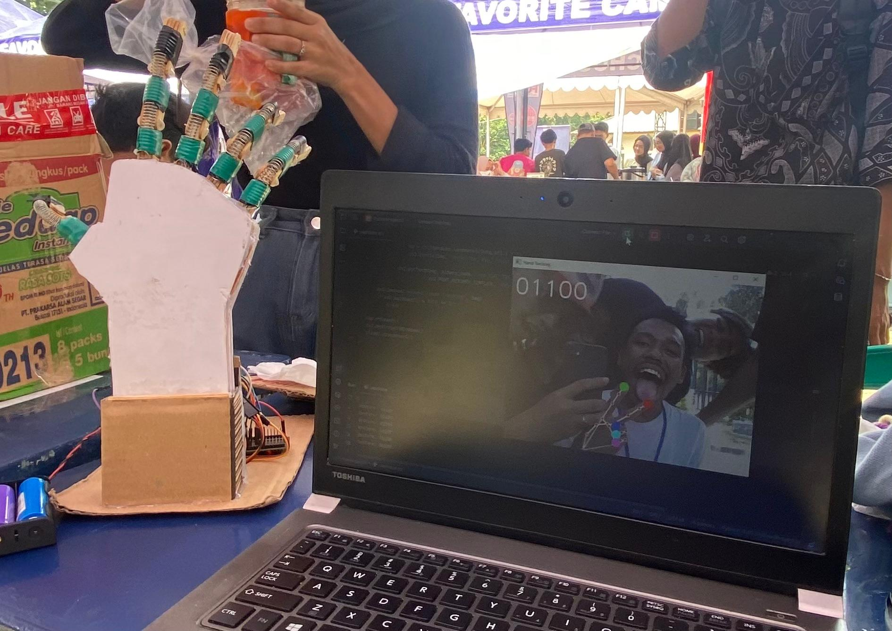
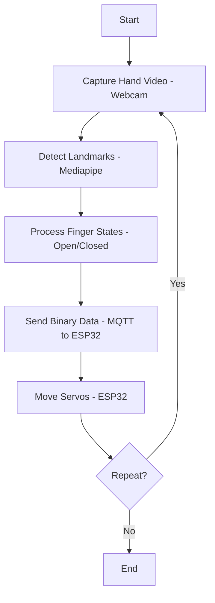

<h1 align="center">🖐️ Gesture Clone Robot</h1>
<p align="center">Prototipe robot yang meniru gerakan tangan manusia secara real-time menggunakan Mediapipe dan ESP32</p>

<p align="center">
  
</p>

<p align="center">
  
  
  
  
  
  <a href="https://github.com/ficrammanifur/ficrammanifur/blob/main/LICENSE">
    
  </a>
</p>

---

## 🚀 Fitur

- ✅ **Hand Tracking Real-Time**  
  Menggunakan Mediapipe untuk mendeteksi gerakan tangan secara langsung.

- ✅ **Kontrol 5 Servo Motor**  
  Menggerakkan servo untuk meniru gerakan jari (ibu jari, telunjuk, jari tengah, manis, kelingking).

- ✅ **Komunikasi MQTT**  
  Mengirim data gerakan jari dari Python ke ESP32 melalui MQTT broker.

- ✅ **Open Source**  
  Sistem berbasis open source, ideal untuk prostetik, teleoperasi robotik, atau edukasi mekatronika.

---

## 🛠 Komponen

### 📦 Perangkat Keras

- **ESP32**: Mikrokontroler untuk mengendalikan servo motor.
- **Servo Motor (SG90/MG90)**: 5 motor untuk meniru gerakan jari (satu per jari).
- **Webcam**: Menangkap gerakan tangan pengguna.

### 💻 Perangkat Lunak

- **Python**: Pemrosesan gambar dan deteksi tangan.
- **Mediapipe**: Deteksi landmark jari secara real-time.
- **OpenCV**: Pengambilan dan pemrosesan gambar dari webcam.
- **MQTT**: Komunikasi melalui broker `broker.emqx.io:1883`.
- **Arduino IDE / PlatformIO**: Pemrograman ESP32.

---

## 📁 Struktur File

| File                      | Deskripsi                                                    |
|---------------------------|--------------------------------------------------------------|
| `hand_tracking.py`      | Skrip Python untuk deteksi tangan dan pengiriman data MQTT  |
| `gesture_clone_robot.ino` | Kode ESP32 untuk kontrol servo berdasarkan data MQTT      |
| `README.md`             | Dokumentasi proyek                                           |

---

## ⚙️ Arsitektur Sistem

### 🔗 Diagram Blok Hardware / Software

```text
+----------------+       +----------------------+       +-----------------+
|    Webcam      | ----> | Python + Mediapipe   | ----> |      ESP32      |
| (Hand Input)   |       | (Hand Tracking &     |       |  (Servo Control)|
|                |       |   MQTT Publisher)    |       |                 |
+----------------+       +----------------------+       +--------+--------+
                                                            |
                                                            v
                    +-------+-------+-------+-------+-------+
                    | Servo | Servo | Servo | Servo | Servo |
                    |  1    |  2    |  3    |  4    |  5    |
                    |Thumb  |Index  |Middle | Ring  | Pinky |
                    +-------+-------+-------+-------+-------+
```

**Penjelasan:**
- **Webcam**: Menangkap gerakan tangan secara real-time.
- **Python + Mediapipe**: Deteksi status jari & kirim data ke ESP32.
- **ESP32**: Menggerakkan servo sesuai status jari.

### 📊 Flowchart Sistem



---

## 🚀 Cara Menjalankan

### 1. Persiapan Perangkat Keras

- Hubungkan 5 Servo Motor ke pin ESP32 (contoh: pin 12, 13, 14, 15, 16).
- Pastikan webcam terhubung ke komputer.
- Sambungkan ESP32 ke daya dan pastikan terhubung ke WiFi.

### 2. Konfigurasi Perangkat Lunak

#### Python

Install dependensi:

```bash
pip install opencv-python mediapipe paho-mqtt
```

### 3. Upload kode ke ESP32

- Buka file `gesture_clone_robot.ino` di Arduino IDE atau PlatformIO.
- Install library:
  - WiFi
  - PubSubClient
  - ESP32Servo
- Edit variabel:

```cpp
const char* ssid = "NamaWiFi";
const char* password = "PasswordWiFi";
const char* mqttServer = "broker.emqx.io";
```

- Upload ke ESP32.

### 4. Jalankan Python Script

Edit `hand_tracking.py`:

**MQTT broker:**
`broker.emqx.io:1883`

**Topik MQTT:**
`gesture/robot/control` (atau sesuaikan)

---

## 🧪 Pengujian

1. **Hand Tracking**: Gerakkan tangan di depan webcam, Mediapipe mendeteksi posisi jari.
2. **Kontrol Servo**: ESP32 menerima data biner (misalnya: `11001`) lalu menggerakkan servo.
3. **MQTT**:
   - Python publish ke: `gesture/robot/control`
   - ESP32 subscribe ke topik yang sama.

---

## 🔧 Konfigurasi

### MQTT Broker
- **Host**: `broker.emqx.io`
- **Port**: `1883`
- **Topik**: `gesture/robot/control`

### Library Python
- `opencv-python`
- `mediapipe`
- `paho-mqtt`

### Library ESP32
- `WiFi`
- `PubSubClient`
- `ESP32Servo`

---

## 📊 Monitoring

### Python Console

Contoh output:

```csharp
[INFO] Jari terdeteksi: 11001
[INFO] Data dikirim ke MQTT: gesture/robot/control
```

### Serial Monitor (ESP32)

Gunakan baud rate 115200:

```csharp
[INFO] Data diterima: 11001
[INFO] Servo diatur: Jari 1=180°, Jari 2=0°, ...
```

## 🐞 Debugging

### Hand Tracking Gagal
- Periksa webcam dan pencahayaan.
- Tes Mediapipe:

```python
import mediapipe as mp
print(mp.__version__)
```

### Servo Tidak Bergerak
- Periksa wiring servo ke pin ESP32.
- Pastikan tegangan cukup (gunakan power supply eksternal jika perlu).
- Cek Serial Monitor ESP32.

### MQTT Gagal
- Pastikan ESP32 terhubung ke WiFi.
- Tes MQTT dengan tool:

```bash
mosquitto_sub -h broker.emqx.io -t gesture/robot/control
```

## ⚠️ Catatan Penting

- Gunakan pencahayaan yang cukup untuk akurasi deteksi tangan.
- Gunakan power supply eksternal untuk servo jika ESP32 tidak cukup kuat.
- Pastikan port MQTT (1883) tidak diblokir jaringan.

---

## 🙌 Kontribusi

Pull request, ide pengembangan, dan diskusi sangat diterima!
Silakan buka Issue untuk pertanyaan, saran, atau pelaporan bug.

<div align="center">

**⚡ Built with Python, Mediapipe & ESP32**

**⭐ Star this repo if you like it!**

<p><a href="#top">⬆ Kembali ke Atas</a></p>

</div>
