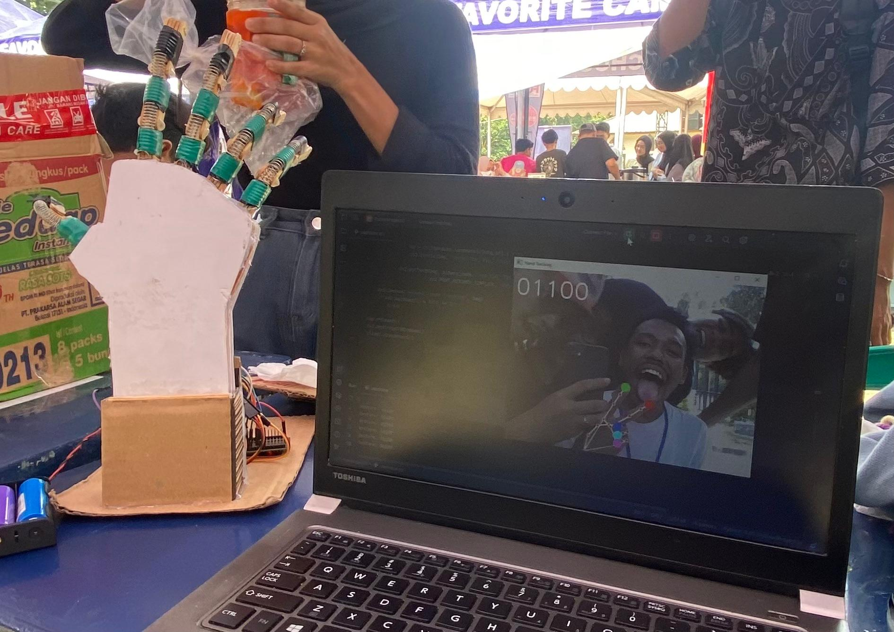
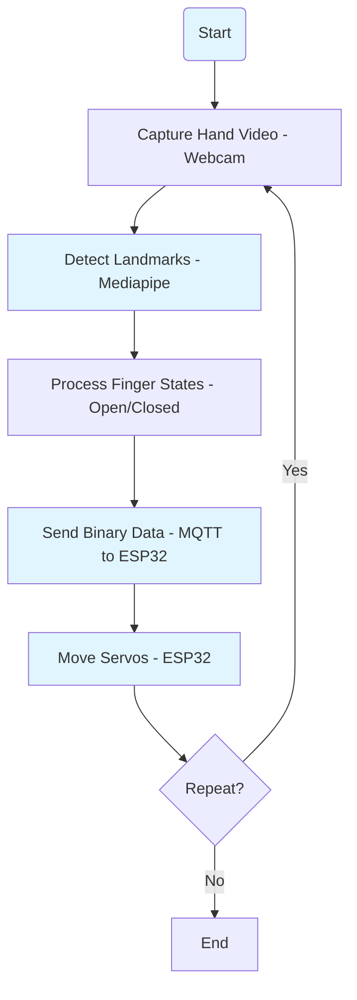
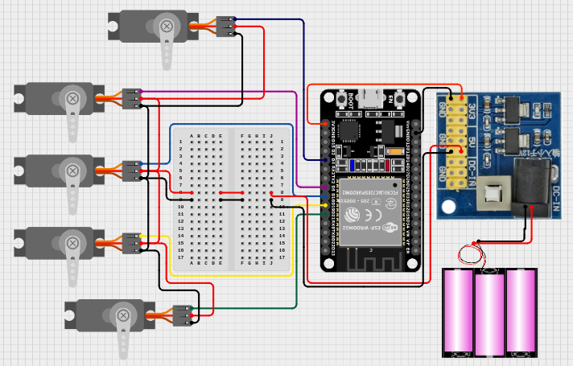

<h1 align="center">🖐️ GESTURE CLONE ROBOT</h1>

<p align="center">
  
</p>

<p align="center">
  <em>Prototipe robot yang meniru gerakan tangan manusia secara real-time menggunakan Mediapipe dan ESP32</em>
</p>

<p align="center">
  
  
  
  
  
  
  <a href="https://github.com/ficrammanifur/gesture-clone-robot/blob/main/LICENSE">
    
  </a>
</p>

---

## 📑 Table of Contents

- [✨ Overview](#-overview)
- [🚀 Fitur](#-fitur)
- [🏗️ Arsitektur Sistem](#️-arsitektur-sistem)
- [🛠 Komponen](#-komponen)
- [📁 Struktur File](#-struktur-file)
- [⚙️ Instalasi](#️-instalasi)
- [🚀 Cara Menjalankan](#-cara-menjalankan)
- [🧪 Testing](#-testing)
- [📊 Monitoring](#-monitoring)
- [🔧 Konfigurasi](#-konfigurasi)
- [🐞 Troubleshooting](#-troubleshooting)
- [🤝 Kontribusi](#-kontribusi)
- [📄 Lisensi](#-lisensi)

---

## ✨ Overview

**Gesture Clone Robot** adalah sistem robotika yang menggunakan computer vision untuk meniru gerakan tangan manusia secara real-time. Sistem ini menggabungkan teknologi Mediapipe untuk hand tracking, MQTT untuk komunikasi wireless, dan ESP32 untuk kontrol servo motor.

### 🎯 Tujuan Proyek
- **Prostetik Tangan** - Membantu penyandang disabilitas
- **Teleoperasi Robotik** - Kontrol robot jarak jauh
- **Edukasi Mekatronika** - Platform pembelajaran
- **Penelitian HMI** - Human-Machine Interface

---

## 🚀 Fitur

- ✅ **Hand Tracking Real-Time**  
  Menggunakan Mediapipe untuk mendeteksi 21 landmark tangan dengan akurasi tinggi

- ✅ **Kontrol 5 Servo Motor**  
  Menggerakkan servo untuk meniru gerakan jari (ibu jari, telunjuk, jari tengah, manis, kelingking)

- ✅ **Komunikasi MQTT Wireless**  
  Mengirim data gerakan jari dari Python ke ESP32 melalui MQTT broker

- ✅ **Gesture Recognition**  
  Mengenali berbagai gesture tangan seperti fist, peace, thumbs up, dll.

- ✅ **Open Source**  
  Sistem berbasis open source, ideal untuk prostetik, teleoperasi robotik, atau edukasi

---

## 🏗️ Arsitektur Sistem

### 🔗 Diagram Blok Hardware/Software

```text
┌─────────────────┐    USB     ┌──────────────────────┐    WiFi    ┌─────────────────┐
│     Webcam      │ ◄────────► │  Python Computer     │ ◄────────► │   WiFi Router   │
│  (Hand Input)   │            │  • OpenCV            │            │                 │
│                 │            │  • Mediapipe         │            │                 │
└─────────────────┘            │  • MQTT Publisher    │            └─────────────────┘
                               └──────────────────────┘                     │
                                         │                                  │ WiFi
                                         │ MQTT                             │
                                         ▼                                  ▼
                               ┌──────────────────────┐            ┌─────────────────┐
                               │   MQTT Broker        │ ◄────────► │      ESP32      │
                               │  (broker.emqx.io)    │    MQTT    │ (Servo Control) │
                               └──────────────────────┘            └─────────────────┘
                                                                            │
                                                                            │ GPIO/PWM
                                                                            ▼
                                    ┌────────────────────────────────────────────────────┐
                                    │                Servo Motors                        │
                                    │  ┌───────┐ ┌───────┐ ┌───────┐ ┌───────┐ ┌───────┐ │
                                    │  │Servo 1│ │Servo 2│ │Servo 3│ │Servo 4│ │Servo 5│ │
                                    │  │ Thumb │ │ Index │ │Middle │ │ Ring  │ │ Pinky │ │
                                    │  │Pin 12 │ │Pin 13 │ │Pin 14 │ │Pin 15 │ │Pin 16 │ │
                                    │  └───────┘ └───────┘ └───────┘ └───────┘ └───────┘ │
                                    └────────────────────────────────────────────────────┘
```

### 📊 Flowchart Sistem



---

## 🛠 Komponen

### 📦 Perangkat Keras

| Komponen | Spesifikasi | Quantity | Pin Connection | Fungsi |
|----------|-------------|----------|----------------|---------|
| **ESP32** | ESP32-WROOM-32 | 1 | - | Mikrokontroler utama |
| **Servo Motor** | SG90/MG90S | 5 | 12,13,14,15,16 | Aktuator jari |
| **Webcam** | USB 2.0, 720p+ | 1 | USB Port | Input gerakan tangan |
| **Power Supply** | 5V 3A | 1 | VIN, GND | Catu daya servo |
| **Jumper Wires** | Male-Male | 15 | - | Koneksi |

### 💻 Perangkat Lunak

| Software | Version | Fungsi |
|----------|---------|---------|
| **Python** | 3.8+ | Hand tracking & MQTT |
| **OpenCV** | 4.5+ | Computer vision |
| **Mediapipe** | 0.8+ | Hand landmark detection |
| **Paho-MQTT** | 1.6+ | MQTT communication |
| **Arduino IDE** | 2.0+ | ESP32 programming |

---

## 📁 Struktur File

```text
gesture-clone-robot/
├── 📄 README.md                    # Dokumentasi proyek
├── 📋 requirements.txt             # Python dependencies
├── 🐍 python/
│   └── hand_tracking.py           # Script utama hand tracking
├── 🤖 arduino/
│   └── gesture_clone_robot.ino    # Kode utama ESP32
└── 🖼️ assets/
    ├── prototype.png              # Foto prototype
    ├── wiring_diagram.png         # Diagram pengkabelan
    ├── hand_landmarks.png         # Mediapipe landmarks
    └── demo_video.mp4             # Video demonstrasi
```

---

## ⚙️ Instalasi

### 1. 🔧 Clone Repository

```bash
git clone https://github.com/ficrammanifur/gesture-clone-robot.git
cd gesture-clone-robot
```

### 2. 🐍 Setup Python Environment

#### Install Dependencies
```bash
pip install -r requirements.txt

# Atau install manual
pip install opencv-python mediapipe paho-mqtt numpy
```

#### Verify Installation
```python
import cv2
import mediapipe as mp
import paho.mqtt.client as mqtt

print("OpenCV version:", cv2.__version__)
print("Mediapipe version:", mp.__version__)
print("✅ All dependencies installed successfully!")
```

### 3. 🤖 Setup ESP32

#### Install Arduino IDE & Libraries
1. Download Arduino IDE dari [arduino.cc](https://www.arduino.cc/en/software)
2. Install ESP32 board package
3. Install libraries:
   - PubSubClient by Nick O'Leary
   - ESP32Servo by Kevin Harrington

#### Configure ESP32 Code
Edit `arduino/gesture_clone_robot.ino`:
```cpp
// WiFi Configuration
const char* ssid = "YOUR_WIFI_SSID";
const char* password = "YOUR_WIFI_PASSWORD";

// MQTT Configuration
const char* mqttServer = "broker.emqx.io";
const int mqttPort = 1883;
const char* mqttTopic = "gesture/robot/control";
```

### 4. 🔌 Hardware Assembly

#### Wiring Diagram
<p align="center">
  
</p>

#### Pin Connections
```text
ESP32 Pin    │ Servo Motor    │ Wire Color
─────────────┼────────────────┼────────────
GPIO 12      │ Thumb Servo    │ Orange
GPIO 13      │ Index Servo    │ Orange  
GPIO 14      │ Middle Servo   │ Orange
GPIO 15      │ Ring Servo     │ Orange
GPIO 16      │ Pinky Servo    │ Orange
5V           │ All Servos     │ Red
GND          │ All Servos     │ Brown/Black
```

---

## 🚀 Cara Menjalankan

### 1. 🔌 Start ESP32

1. **Upload Code**
   ```
   Arduino IDE → Open gesture_clone_robot.ino
   Select Board: ESP32 Dev Module
   Select Port: (your ESP32 port)
   Click Upload
   ```

2. **Monitor Serial Output** (Baud Rate: 115200)
   ```
   [INFO] Starting Gesture Clone Robot...
   [INFO] WiFi connected! IP: 192.168.1.100
   [INFO] MQTT connected successfully
   [INFO] System ready - waiting for commands
   ```

### 2. 🐍 Run Python Script

```bash
cd python
python hand_tracking.py
```

### 3. 🎯 Testing System

1. **Posisikan tangan** di depan webcam (jarak 30-60cm)
2. **Pastikan pencahayaan** cukup
3. **Gerakkan jari-jari** secara perlahan
4. **Amati response** servo motor

#### Test Gestures:
- **Closed Fist**: Semua servo ke posisi 0° (11111)
- **Open Hand**: Semua servo ke posisi 180° (00000)
- **Peace Sign**: Index dan middle finger open (00110)
- **Thumbs Up**: Hanya thumb open (01111)

---

## 🧪 Testing

### 🔬 Hand Detection Test

```python
# Test Mediapipe installation
import mediapipe as mp
print("Mediapipe version:", mp.__version__)

# Test camera
import cv2
cap = cv2.VideoCapture(0)
if cap.isOpened():
    print("✅ Camera working")
else:
    print("❌ Camera not found")
cap.release()
```

### 📡 MQTT Communication Test

```bash
# Terminal 1: Subscribe to MQTT topic
mosquitto_sub -h broker.emqx.io -t gesture/robot/control

# Terminal 2: Publish test data
mosquitto_pub -h broker.emqx.io -t gesture/robot/control -m "11001"
```

### 🤖 Servo Response Test

Upload kode test ke ESP32:
```cpp
void testServos() {
  Serial.println("Testing all servos...");
  
  // Test each servo
  for(int i = 0; i < 5; i++) {
    servos[i].write(0);    // Close
    delay(1000);
    servos[i].write(180);  // Open
    delay(1000);
    servos[i].write(90);   // Center
    delay(500);
  }
  
  Serial.println("✅ Servo test complete");
}
```

---

## 📊 Monitoring

### 🖥️ Python Console Output

```text
[2024-01-15 14:30:25] INFO: Hand tracking initialized
[2024-01-15 14:30:25] INFO: MQTT connected to broker.emqx.io:1883
[2024-01-15 14:30:25] INFO: Camera opened successfully (ID: 0)
─────────────────────────────────────────────────────
[14:30:26] HAND DETECTED: 5 fingers
[14:30:26] Finger states: [1,1,0,0,1] (Thumb:Open, Index:Open, Middle:Closed, Ring:Closed, Pinky:Open)
[14:30:26] MQTT Published: gesture/robot/control → "11001"
[14:30:26] Latency: 42ms | FPS: 23.5
─────────────────────────────────────────────────────
[14:30:27] GESTURE DETECTED: Peace Sign
[14:30:27] Finger states: [0,1,1,0,0] (Index and Middle open)
[14:30:27] MQTT Published: gesture/robot/control → "01100"
[14:30:27] Latency: 38ms | FPS: 24.1
─────────────────────────────────────────────────────
```

### 🤖 ESP32 Serial Monitor

Baud Rate: **115200**

```text
[INFO] Gesture Clone Robot v1.0
[INFO] WiFi connected! IP: 192.168.1.100
[INFO] MQTT connected to broker.emqx.io:1883
[INFO] Servo initialization complete
[INFO] System ready - listening for commands
─────────────────────────────────────────────────────
[14:30:26] MQTT Received: "11001"
[14:30:26] Parsing finger data: T:1 I:1 M:0 R:0 P:1
[14:30:26] Servo angles: [180°, 180°, 0°, 0°, 180°]
[14:30:26] ✅ Servos moved successfully
─────────────────────────────────────────────────────
[14:30:27] MQTT Received: "01100"  
[14:30:27] Parsing finger data: T:0 I:1 M:1 R:0 P:0
[14:30:27] Servo angles: [0°, 180°, 180°, 0°, 0°]
[14:30:27] ✅ Servos moved successfully
─────────────────────────────────────────────────────
```

---

## 🔧 Konfigurasi

### ⚙️ Python Configuration

Edit `python/hand_tracking.py`:

```python
# Camera Configuration
CAMERA_ID = 0
CAMERA_WIDTH = 640
CAMERA_HEIGHT = 480

# Mediapipe Configuration  
MIN_DETECTION_CONFIDENCE = 0.7
MIN_TRACKING_CONFIDENCE = 0.5

# MQTT Configuration
MQTT_BROKER = "broker.emqx.io"
MQTT_PORT = 1883
MQTT_TOPIC = "gesture/robot/control"
MQTT_CLIENT_ID = "GestureRobot_Python"

# Finger Detection Thresholds
FINGER_THRESHOLDS = {
    'thumb': 0.6,
    'index': 0.7,
    'middle': 0.7,
    'ring': 0.7,
    'pinky': 0.6
}
```

### 🤖 ESP32 Configuration

Edit `arduino/gesture_clone_robot.ino`:

```cpp
// WiFi Configuration
const char* ssid = "YOUR_WIFI_SSID";
const char* password = "YOUR_WIFI_PASSWORD";

// MQTT Configuration
const char* mqttServer = "broker.emqx.io";
const int mqttPort = 1883;
const char* mqttTopic = "gesture/robot/control";
const char* clientId = "GestureRobot_ESP32";

// Servo Pin Configuration
const int servoPins[5] = {12, 13, 14, 15, 16};

// Servo Angle Configuration
const int servoMinAngle = 0;
const int servoMaxAngle = 180;
const int servoSpeed = 15;  // ms delay between steps
```

---

## 🐞 Troubleshooting

### ❌ Common Issues & Solutions

#### **1. Hand Detection Not Working**

**Symptoms:**
- No hand landmarks detected
- Erratic finger detection

**Solutions:**
- ✅ Periksa pencahayaan (tidak terlalu gelap/terang)
- ✅ Pastikan tangan dalam frame kamera
- ✅ Jarak optimal: 30-60cm dari kamera
- ✅ Background kontras dengan warna kulit

```python
# Test camera
import cv2
cap = cv2.VideoCapture(0)
ret, frame = cap.read()
if ret:
    cv2.imshow('Camera Test', frame)
    cv2.waitKey(0)
    print("✅ Camera working")
else:
    print("❌ Camera not working")
cap.release()
cv2.destroyAllWindows()
```

#### **2. MQTT Connection Failed**

**Symptoms:**
```text
[ERROR] MQTT connection failed
[ERROR] Connection refused
```

**Solutions:**
- ✅ Periksa koneksi internet
- ✅ Coba broker alternatif: `test.mosquitto.org`
- ✅ Periksa firewall settings

```bash
# Test MQTT broker
ping broker.emqx.io

# Test with mosquitto client
mosquitto_pub -h broker.emqx.io -t test -m "hello"
```

#### **3. Servo Motors Not Moving**

**Symptoms:**
- Servo tidak bergerak
- Gerakan tidak smooth

**Solutions:**
- ✅ Periksa wiring servo ke ESP32
- ✅ Pastikan power supply 5V cukup (gunakan external power)
- ✅ Cek Serial Monitor ESP32 untuk error

```cpp
// Test individual servo
void testServo(int servoIndex) {
  Serial.print("Testing servo ");
  Serial.println(servoIndex);
  
  servos[servoIndex].write(0);
  delay(1000);
  servos[servoIndex].write(180);
  delay(1000);
  servos[servoIndex].write(90);
  
  Serial.println("✅ Servo test complete");
}
```

#### **4. WiFi Connection Issues**

**Symptoms:**
```text
[ERROR] WiFi connection failed
[ERROR] WiFi disconnected
```

**Solutions:**
- ✅ Periksa SSID dan password
- ✅ Pastikan WiFi 2.4GHz (bukan 5GHz)
- ✅ Cek jarak ESP32 ke router

```cpp
// Enhanced WiFi connection
void connectWiFi() {
  WiFi.begin(ssid, password);
  Serial.print("Connecting to WiFi");
  
  int attempts = 0;
  while (WiFi.status() != WL_CONNECTED && attempts < 20) {
    delay(500);
    Serial.print(".");
    attempts++;
  }
  
  if (WiFi.status() == WL_CONNECTED) {
    Serial.println();
    Serial.print("✅ WiFi connected! IP: ");
    Serial.println(WiFi.localIP());
  } else {
    Serial.println();
    Serial.println("❌ WiFi connection failed");
  }
}
```

#### **5. High Latency Issues**

**Symptoms:**
- Delayed servo response
- Low frame rate

**Solutions:**
- ✅ Reduce camera resolution
- ✅ Close unnecessary applications
- ✅ Use faster computer/better webcam

```python
# Optimize performance
cap.set(cv2.CAP_PROP_FRAME_WIDTH, 320)
cap.set(cv2.CAP_PROP_FRAME_HEIGHT, 240)
cap.set(cv2.CAP_PROP_BUFFERSIZE, 1)
```

---

## 🤝 Kontribusi

Kontribusi sangat diterima! Mari bersama-sama mengembangkan teknologi gesture control.

### 📋 How to Contribute

1. **🍴 Fork** repository ini
2. **🌿 Create** feature branch (`git checkout -b feature/AmazingFeature`)
3. **💾 Commit** changes (`git commit -m 'Add some AmazingFeature'`)
4. **📤 Push** to branch (`git push origin feature/AmazingFeature`)
5. **🔄 Open** Pull Request

### 🎯 Areas for Contribution

- [ ] **Machine Learning** - Implement gesture learning algorithms
- [ ] **Mobile App** - Develop Android/iOS companion app
- [ ] **Hardware Design** - Create custom PCB design
- [ ] **Documentation** - Improve docs and add tutorials
- [ ] **Testing** - Add unit tests and integration tests

### 🐛 Bug Reports

Gunakan GitHub Issues dengan informasi:
- Deskripsi bug yang jelas
- Steps to reproduce
- Expected vs actual behavior
- Environment (OS, Python version, dll)
- Screenshots/video jika memungkinkan

---

## 👨‍💻 Pengembang

**Ficram Manifur**
- 🐙 GitHub: [@ficrammanifur](https://github.com/ficrammanifur)
- 🌐 Portfolio: [ficrammanifur.github.io](https://ficrammanifur.github.io/ficram-portfolio)
- 📧 Email: ficramm@gmail.com

### 🙏 Acknowledgments

- **Google Mediapipe Team** - Hand tracking framework
- **ESP32 Community** - Arduino libraries dan dokumentasi
- **OpenCV Contributors** - Computer vision library
- **MQTT.org** - Reliable communication protocol

---

## 📄 Lisensi

Proyek ini dilisensikan di bawah **MIT License** - lihat file [LICENSE](LICENSE) untuk detail lengkap.

```text
MIT License

Copyright (c) 2025 ficrammanifur

Permission is hereby granted, free of charge, to any person obtaining a copy
of this software and associated documentation files (the "Software"), to deal
in the Software without restriction, including without limitation the rights
to use, copy, modify, merge, publish, distribute, sublicense, and/or sell
copies of the Software, and to permit persons to whom the Software is
furnished to do so, subject to the following conditions:

The above copyright notice and this permission notice shall be included in all
copies or substantial portions of the Software.

THE SOFTWARE IS PROVIDED "AS IS", WITHOUT WARRANTY OF ANY KIND, EXPRESS OR
IMPLIED, INCLUDING BUT NOT LIMITED TO THE WARRANTIES OF MERCHANTABILITY,
FITNESS FOR A PARTICULAR PURPOSE AND NONINFRINGEMENT. IN NO EVENT SHALL THE
AUTHORS OR COPYRIGHT HOLDERS BE LIABLE FOR ANY CLAIM, DAMAGES OR OTHER
LIABILITY, WHETHER IN AN ACTION OF CONTRACT, TORT OR OTHERWISE, ARISING FROM,
OUT OF OR IN CONNECTION WITH THE SOFTWARE OR THE USE OR OTHER DEALINGS IN THE
SOFTWARE.
```

---

<div align="center">

**🖐️ Bridging Human Gestures with Robotic Precision**

**⚡ Built with Python, Mediapipe & ESP32**

**⭐ Star this repo if you like it!**

<p><a href="#top">⬆ Kembali ke Atas</a></p>

</div>
